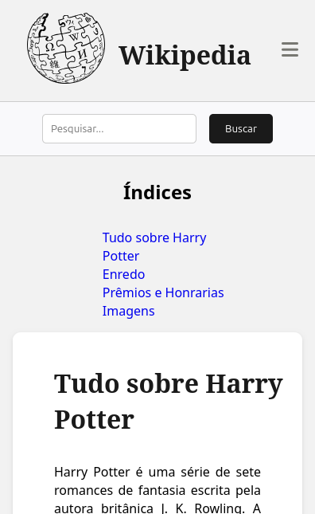
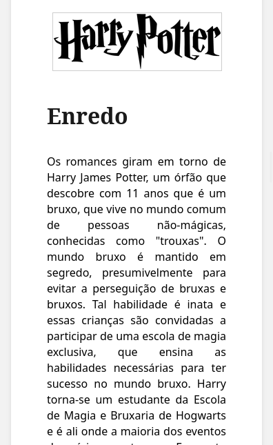
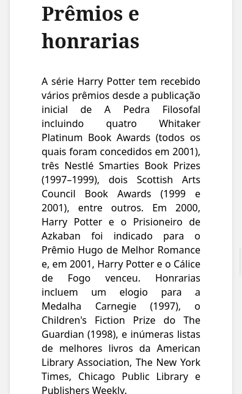
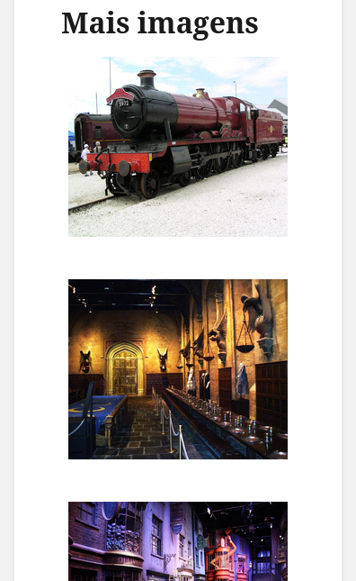

# Wikipedia

### O que é o projeto?
#### O projeto consiste em utilizar o famoso site Wikipedia como modelo e deixar ele com um visual mais moderno.

O tema para o projeto foi Harry Potter, uma série de sete romances de fantasia escrita pela autora britânica J. K. Rowling. A série narra as aventuras de um jovem chamado Harry Potter, que descobre aos 11 anos de idade que é um bruxo ao ser convidado para estudar na Escola de Magia e Bruxaria de Hogwarts. O arco de história principal diz respeito às amizades de Harry com outros bruxos de sua idade, como Ron Weasley e Hermione Granger, e também com o diretor de Hogwarts Albus Dumbledore, considerado o maior dos bruxos, e seus conflitos com o bruxo das trevas Lord Voldemort, que pretende se tornar imortal, conquistar o mundo dos bruxos, subjugar as pessoas não-mágicas(chamados trouxas) e destruir todos aqueles que estão em seu caminho, especialmente Harry Potter, a quem ele considera seu maior rival. 

### Tecnologias utilizadas: 

 + HTML
 + CSS
 + JavaScript

 ### Imagens

